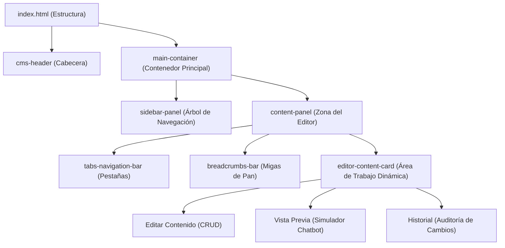

# Documentación Funcional - WienerBot CMS

Esta documentación describe en detalle la arquitectura, la estructura de componentes, la ubicación de los archivos y los flujos del sistema de gestión de contenidos (CMS) para el chatbot institucional **WienerBot** de la Universidad Norbert Wiener.

---

## 1. Arquitectura y Estructura General

El proyecto está construido bajo un enfoque ligero y de alto rendimiento utilizando tecnologías web estándar (HTML5 Semántico, CSS3 Vanilla sin variables, y JavaScript ES6 puro).



---

## 2. Inventario y Ubicación de Archivos

El código fuente del proyecto se organiza en tres archivos principales ubicados en el directorio raíz de la aplicación:

| Archivo | Tipo de Contenido | Ubicación | Descripción |
| :--- | :--- | :--- | :--- |
| **`index.html`** | Estructura Semántica | `[directorio_raiz]/index.html` | Define el esqueleto HTML5, la barra lateral estática, los wrappers de las pestañas principales, y todos los cuadros de diálogo modales (`<dialog>`). |
| **`styles.css`** | Diseño y Animaciones | `[directorio_raiz]/styles.css` | Define el sistema de diseño visual (tipografía, paletas de colores estáticas, layouts flexbox, scrollbars, sombras y transiciones animadas). **No utiliza variables CSS**. |
| **`app.js`** | Lógica de Negocio y Estado | `[directorio_raiz]/app.js` | Controla el estado del CMS, operaciones CRUD locales, renderizado recursivo del árbol, persistencia, simulador de chatbot e historial. |
| **`Design.md`** | Especificación de Diseño | `[directorio_raiz]/Design.md` | Documento de referencia con directrices tipográficas, colores, formas y layouts para mantener consistencia. |

---

## 3. Descripción y Funcionalidad de Componentes

### A. Cabecera (`.cms-header`)
* **Ubicación Física**: `index.html` (Líneas 17-72), `styles.css` (Líneas 38-177).
* **Funcionalidad**:
  * Muestra el logo corporativo de **WienerBot** y la etiqueta de perfil de usuario (`Admin`).
  * Contiene el input de búsqueda de texto `#header-search-input`. Al escribir, filtra en tiempo real la barra lateral (ocultando nodos que no coinciden ni tienen descendientes que coincidan).
  * Muestra el indicador de base de datos activa (`Oracle ODA`) y el avatar del usuario conectado (`EB`).

### B. Barra Lateral / Árbol de Contenido (`.sidebar-panel`)
* **Ubicación Física**: `index.html` (Líneas 77-106), `styles.css` (Líneas 185-385), `app.js` (Líneas 300-464).
* **Funcionalidad**:
  * Renderiza dinámicamente un árbol jerárquico recursivo de múltiples niveles.
  * Muestra carets de colapso/expansión `>` rotativos para nodos padre (Categorías y Subcategorías).
  * Distingue visualmente el nivel raíz (Categorías principales) con tipografía en negrita pesada (`font-weight: 800`).
  * Agrega etiquetas a las subcategorías según su tipo (`FAQ` en verde, `DIRECTO` en naranja).
  * Cuenta con botones de acción rápida en línea (`+ Añadir subcategoría` y `+ Añadir pregunta`) que aparecen únicamente cuando el nodo está expandido.
  * Soporta scroll vertical y horizontal independiente para árboles profundamente anidados.

### C. Barra de Navegación de Pestañas (`.tabs-navigation-bar`)
* **Ubicación Física**: `index.html` (Líneas 111-123), `styles.css` (Líneas 396-434), `app.js` (Líneas 1667-1682).
* **Funcionalidad**:
  * Alterna el contenido de la tarjeta del editor entre tres modos:
    1. **Editar contenido**: Formulario de modificación del nodo seleccionado.
    2. **Vista previa**: Simulador de chatbot conversacional.
    3. **Historial**: Tabla de auditoría con logs del sistema.

### D. Migas de Pan / Breadcrumbs (`.breadcrumbs-bar`)
* **Ubicación Física**: `index.html` (Líneas 125-128), `styles.css` (Líneas 435-485), `app.js` (Líneas 466-505).
* **Funcionalidad**:
  * Muestra la ruta completa desde la raíz hasta el nodo actualmente seleccionado (ej. `🎓 Pregrado Presencial › 📂 Accesos › 📄 Recuperar credenciales`).
  * Cada elemento anterior actúa como un enlace rápido interactivo; hacer clic en él desplaza la selección y carga el editor para ese nodo.

### E. Área de Trabajo Principal / Editor (`#editor-fields-area`)
* **Ubicación Física**: `index.html` (Línea 131), `styles.css` (Líneas 486-853), `app.js` (Líneas 507-987).
* **Funcionalidad**:
  * Si **no hay ningún nodo seleccionado**, renderiza la pantalla de inicio (*Home Dashboard*) mostrando estadísticas en tiempo real (N° Categorías, N° Subcategorías, N° Preguntas) y un botón de llamada a la acción para crear una nueva categoría.
  * Si se selecciona una **Categoría**: Carga campos para modificar su Nombre y Mensaje Inicial.
  * Si se selecciona una **Subcategoría**:
    * Muestra un selector visual horizontal del tipo de contenido (`FAQ` / `DIRECTO`).
    * Muestra una advertencia dinámica indicando que el cambio de tipo destruirá el contenido hijo asociado.
    * Si es `FAQ`, expone el campo de mensaje inicial.
    * Si es `DIRECTO`, expone un editor WYSIWYG para escribir la respuesta directa.
  * Si se selecciona una **Pregunta**:
    * Muestra campos para editar el texto de la pregunta y el editor de respuesta enriquecida.
    * Enlista al final enlaces rápidos a las preguntas "hermanas" pertenecientes a la misma subcategoría.
  * Cuenta con barra de acciones inferiores para **Guardar** cambios o **Eliminar** el elemento.

### F. Modales de Diálogo (`<dialog>`)
* **Ubicación Física**: `index.html` (Líneas 139-363), `styles.css` (Líneas 854-1108, 1679-1730, 1805-1838), `app.js` (Líneas 989-1402).
* **Funcionalidad**:
  * **Creación**: Formularios flotantes independientes para añadir Categorías, Subcategorías (con selector de tarjetas FAQ/Directo con colores semánticos coincidentes con el árbol) y Preguntas.
  * **Confirmación de Eliminación**: Modal inteligente que calcula recursivamente el impacto en cascada de la eliminación de un nodo (calcula cuántas subcategorías hijas, preguntas y respuestas se perderán en total).
  * **Confirmación de Cambio de Subtipo**: Modales de advertencia específicos que bloquean el cambio de tipo de subcategoría (`FAQ` <-> `DIRECTO`) detallando la cantidad de registros que serán eliminados del almacenamiento si se procede.

---

## 4. Estructura de Datos y Almacenamiento

El estado global de la aplicación se gestiona en memoria y se persiste automáticamente en el navegador a través de `localStorage` bajo dos claves:

1. **`wienerbot_cms_data`**: Almacena el árbol de categorías en la lista `categories` y el mapa plano indexado por IDs en `nodes`.
2. **`wienerbot_cms_history`**: Almacena un arreglo con los logs de auditoría generados por las acciones del usuario.

### Formato de un Nodo en `nodes`:
```javascript
"identificador-unico": {
  id: "identificador-unico",
  type: "category" | "subcategory" | "question",
  subtype: "FAQ" | "DIRECTO", // Solo aplicable si type === "subcategory"
  name: "Nombre del elemento",
  icon: "🎓", // Opcional, para el nivel raíz
  initialMessage: "Mensaje de bienvenida...", // Para categorías o subcategorías FAQ
  directAnswer: "Respuesta en HTML...", // Para subcategorías DIRECTAS
  answer: "Respuesta en HTML...", // Para preguntas FAQ
  children: ["hijo-id-1", "hijo-id-2"], // Lista de IDs de nodos dependientes
  parentId: "padre-id" // ID del nodo superior (null para categorías raíz)
}
```

---

## 5. Guía de Ajustes y Modificaciones

> [!WARNING]
> Para mantener la compatibilidad del sistema y la coherencia del diseño, siga estas directrices al modificar el código.

### ¿Dónde editar si quiero...

#### 1. Cambiar los Colores o la Apariencia Visual?
* **Archivo**: [styles.css](file:///Users/shaper/Desktop/CMS-chatbot/styles.css)
* **Instrucciones**: Busque las reglas del selector correspondiente. 
  * *Ejemplo*: Si desea ajustar los colores de las etiquetas `FAQ` y `DIRECTO`, modifique las clases `.badge-faq`, `.badge-directo`, `.tree-badge`, `.radio-custom-badge` o `.modal-card-badge` en las líneas donde están declarados.
  * **Importante**: No use variables CSS (como `--mi-color: #0F848F;`). Escriba los valores hexadecimales directamente (ej. `color: #0F848F;`).

#### 2. Cambiar los Datos Semilla Iniciales o el Historial por Defecto?
* **Archivo**: [app.js](file:///Users/shaper/Desktop/CMS-chatbot/app.js)
* **Instrucciones**: Modifique las constantes de configuración al inicio del archivo:
  * `DEFAULT_DATA` (Líneas 4-179) para reestructurar las categorías iniciales.
  * `DEFAULT_HISTORY` (Líneas 181-206) para ajustar los logs que aparecen cuando se borra el `localStorage`.
  * *Nota*: Para ver los datos reflejados, recuerde limpiar el almacenamiento del navegador en el inspector de desarrollo (`Application -> Local Storage -> Borrar todo`) y refrescar la página.

#### 3. Añadir un Campo Nuevo a las Categorías, Subcategorías o Preguntas?
* **Paso 1 (HTML)**: En [index.html](file:///Users/shaper/Desktop/CMS-chatbot/index.html), busque los elementos de diálogo de creación correspondientes (ej: `#create-category-modal`) e inserte el nuevo input con una clase `form-input` y un ID descriptivo.
* **Paso 2 (Render de Edición)**: En [app.js](file:///Users/shaper/Desktop/CMS-chatbot/app.js), ubique la función `loadEditTab(node)`. Agregue la estructura HTML correspondiente dentro del template string que renderiza el formulario para la categoría, subcategoría o pregunta deseada, inyectando el valor del nuevo campo mediante `${node.nuevoCampo || ""}`.
* **Paso 3 (Guardado de Cambios)**: En la función `saveSelectedNode(node)` dentro de [app.js](file:///Users/shaper/Desktop/CMS-chatbot/app.js), extraiga el valor del input recién creado usando `document.getElementById("id-de-mi-input").value` y guárdelo en el objeto: `node.nuevoCampo = valorExtraido`.
* **Paso 4 (Creación de Nodos)**: En la función `initCreationModals()`, busque el manejador de guardado correspondiente (ej. `#create-cat-save`), lea el campo del modal e inicialícelo en la estructura del nodo guardado en `state.nodes`.

#### 4. Modificar el Funcionamiento del Chatbot Conversacional?
* **Archivos**: [app.js](file:///Users/shaper/Desktop/CMS-chatbot/app.js) y [styles.css](file:///Users/shaper/Desktop/CMS-chatbot/styles.css).
* **Instrucciones**:
  * Para cambiar el flujo y cómo responde a los clics, modifique `navigateToPreviewNode(nodeId, addUserBubble)` en `app.js`.
  * Para alterar los textos y burbujas que simula, edite la función `renderChatMessages()` en `app.js`.
  * Para cambiar la estructura de burbujas, avatares o iconos, edite los templates HTML literales generados en esa misma función.
  * Los estilos de burbujas, avatares y la ventana del chatbot se encuentran organizados a partir de la clase `.chatbot-window-container` en `styles.css`.

#### 5. Cambiar el Icono o Tipo de Letra General?
* **Archivo**: [index.html](file:///Users/shaper/Desktop/CMS-chatbot/index.html)
* **Instrucciones**:
  * Para cambiar las tipografías de Google Fonts, edite la etiqueta `<link>` ubicada en la sección `<head>` (Línea 9-11).
  * Si desea cambiar las tipografías del CSS, ajuste las propiedades `font-family` en `body` y encabezados dentro de `styles.css`.
